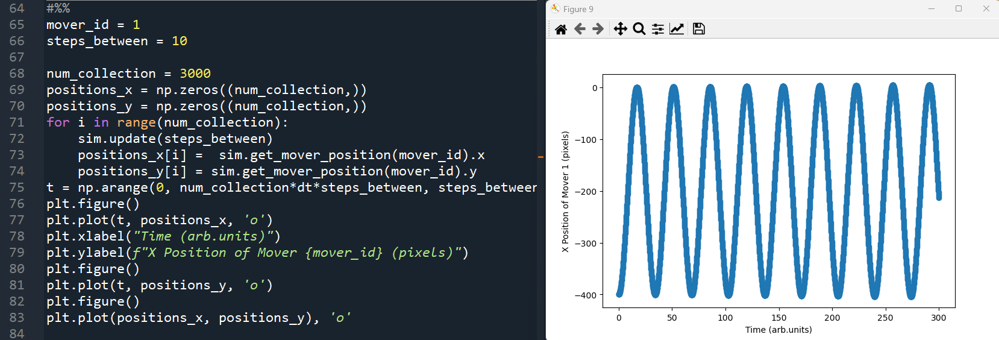

# PhysEngine
 
A 2D Newtonian solver written from scratch in C++ that allows objects to move according to F = ma, under the influence of effects and interactions that are easily specified.
The simulation is multi-threaded to better utilize the computing hardware.
A simple GUI to watch and interact with the simulation is implemented using wxWidgets.
PyBind11 is used to create some python bindings, allowing the simulation to be controlled and its data accessed through a scripting interface.

## Demoed Features

 <h3> A Spring-like interaction along with a "soft collide" interaction, with 500 movers  </h3>
 
  
 (Low quality image from .gif conversion)

  
 

 <h3> Live interactions can be easily added and customized  </h3>
 
  
 A "kick" is applied on command to the moused over object, and the force of the kick increases further from the center 

  
 

 <h3> Movers can be added and grouped in real time   </h3>
 
  
 Movers are created, grouped into a rigid body, and "kicked" into motion

  

  
 

 <h3> Python Scripting   </h3>
 
  
 Python scripting is powered by PyBind11. Simulations can be flexibly setup and run through a python interface, no recompiling necessary. Perfect for exploring simulation parameters.

 

Python can also be used to run and record/plot simulation data without the GUI:  

 
  
 A mover is attached to another mover by a spring, and its position is recorded over tens of thousands of steps and plotted. Directly from Python.

 

